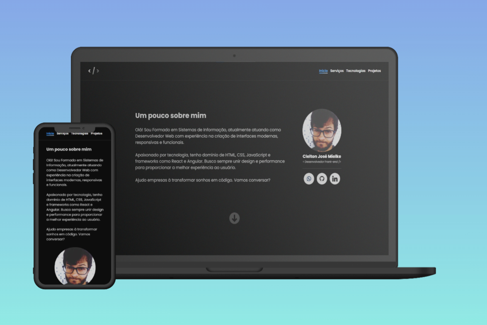

## Demo Website
https://my-portfolio-beta-six-77.vercel.app/

<br/>

<div align="center">
  
</div>
<center>

[](https://forthebadge.com) &nbsp;
[](https://forthebadge.com) &nbsp;
[](https://forthebadge.com) &nbsp;

</center>

## Tecnologias utilizadas<a name="tec" />
O projeto está desenvolvido utilizando as seguintes tecnologias:

* Angular
* TypeScript
* HTML
* SCSS

## Como executar o projeto:<a name="exec" />
```
# Clonar o repositório
$ git clone https://github.com/cleltonjm/my-portfolio

# Entrar no diretório
cd my-portfolio

# Baixar as dependências
$ npm install

# Executar o servidor
$ npm run start
```

Feito isso, abra o seu navegador e acesse `http://localhost:4200/`

-----
Desenvolvido por Clelton José Mielke.